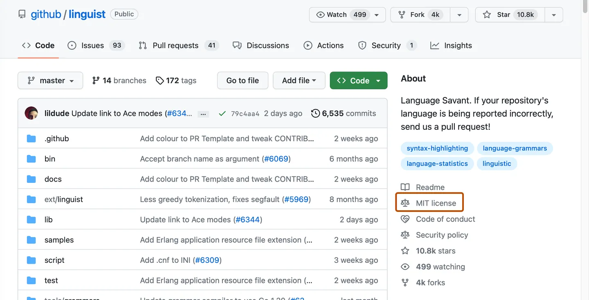
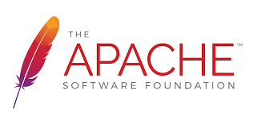
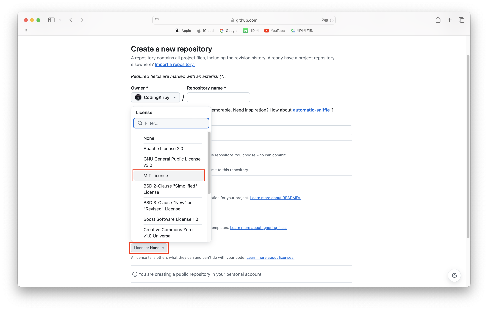

# 오픈소스에 대해서 ARABOZA

- 생성일: 2024년 11월 30일
- 주차: 15주차
- 파트: 오픈소스
- 태그: CS 지식

---

아마도 대부분의 개발자들은 오픈소스가 정확히 뭔지 몰라도 오픈소스를 사용해봤을 것이다.

예를 들어서, Linux, Python, React, Git, MySQL, Chromium(구글 크롬), VS Code,  등… 우리가 실제로 사용하고 있는 다양한 분야의 수많은 소프트웨어들은 오픈소스로 공개가 되어있다.

이때 주의해야 할 건, 오픈소스라고 막 갖다 쓰면 안된다는 것이다.

## 오픈소스 라이선스 왜 알아야 하는가!? ✊

### ***"오픈소스니까 그냥 공짜로 쓰면 되는 거 아냐?”***

큰일 날 소리! 당연히 안 된다!!

오픈소스는 말 그대로 ***“소스 코드가 공개된 소프트웨어”***일 뿐, “공짜로 마음껏 써도 된다”는 의미는 아니다.

오픈소스는 누구나 볼 수 있고 수정하거나 배포할 수 있지만, 이를 사용할 때는 반드시 “**라이선스 조건**”을 지켜야 한다.

### 오픈소스 라이선스? 그게 뭔데요 **🧐**

개발자들의 친구 깃허브를 사용하다 보면 다음과 같은 “MIT license”라는 표시를 한 번 쯤은 마주쳤을 것이다. 이것이 바로 “오픈소스 라이선스”의 일종이다.

”라이선스”는 소프트웨어 사용자가 "어떻게 써야 하는지"를 알려주는 일종의 **규칙**으로,  "이건 꼭 지켜야 하고, 이건 이렇게 하면 안 돼"를 알려주는 가이드라인인 셈이다.

***만약 이를 무시하고 무단으로 사용하면 어떻게 될까!?***

저작권 침해 및 계약 위반으로 **법적 문제**로 번질 수도 있다. 😱

### 오픈소스 라이선스 위반으로 인한 분쟁 사례 **⚖️** (feat. 한컴 vs 아티펙스)

일례로, “한글과컴퓨터”에서는 미국의 소프트웨어 기업 “아티펙스(Artifex Software)”의 오픈소스 소프트웨어인 “고스트스크립트”를 사용할 때 라이선스를 위반해 소송을 당했고, 결국 패소해 한화로 약 23억원에 달하는 합의금을 물었다.  💸

“이걸 보니 오픈소스 쓰기가 무서워지는데요… 😥”

그렇다고 너무 겁먹을 필요는 없다. 오픈소스 프로젝트는 단순히 소스 코드를 공개하는 기술적 개념을 넘어, **협력과 공유**를 통해 더 나은 소프트웨어를 만들어가는 철학적 가치가 담겨 있다.

오픈소스 라이선스는 제한적이기 보다는 우리가 남이 만든 코드를 사용하면서 지켜야 할 최소한의 규칙에 가깝다.

오픈소스를 이용해 특별한 금전적 이득을 취하는 경우가 아니라면 크게 걱정할 필요가 없다!

하지만 그렇다고 해서 우리가 오픈소스 라이선스에 대해서 소홀해도 된다는 의미는 아니다. 우리는 “회사”에 들어가서 일할 개발자 아닌가!? 회사에 손해를 끼치지 않으려면 오픈소스 라이선스가 뭔지는 알아야 하지 않겠어!?

## 대표적인 오픈소스 라이선스 종류

우선 대표적인 라이선스 몇 개만 살펴보러 GOGO👉

### 1. **MIT 라이선스 ✨**

아마 Github나 npm을 사용하면서 다들 한 번쯤은 마주쳤을 **가장 흔한 라이선스**이다. MIT 라이선스는 정말 간단하고 유연한 라이선스이기 때문에 널리 사용되고 있다.

"이 소프트웨어를 마음대로 써도 좋아. 근데, 원본 저작권 표시만 지켜줘!" 정도로 생각하면 된다.

→ 예를 들면, React나 Bootstrap 같은 유명한 프로젝트들이 MIT 라이선스를 사용한다.

### 2. **GPL (GNU General Public License) 🔐**

GPL은 상당히 강력한 오픈소스 라이선스로, **“카피레프트(Copyleft)”**라는 개념이 핵심이다.

"내 코드를 써도 좋지만, 네가 수정하거나 배포한 것도 똑같이 공개해야 해!"라는 조건이 붙는다.

→ 예를 들면, Linux 커널 같은 프로젝트가 GPL을 사용한다.

앞서 살펴본 “한컴 vs 아티펙스”가 바로 이 규약으로 인한 분쟁 사례이다.

### 3. **Apache License 2.0 🛡️**

Apache 라이선스는 **특허**와 관련된 보호 조항이 추가된 라이선스이다.

"내 코드를 네가 써도 특허 문제로 날 고소하면 안 돼!"라는 내용이다. 덕분에 기업들도 많이 사용하는 라이선스이다.

→ 예를 들면, 안드로이드 운영체제가 Apache 라이선스를 사용한다.

### 4. **BSD 라이선스 🗒️**

BSD는 MIT랑 비슷한데, 약간의 차이가 있다. 2-Clause BSD는 간단한 조건만 있지만, 3-Clause BSD는 **광고 조항**이 들어가 있다.

"이걸 광고나 홍보할 때 내 이름을 쓰지 마!" 같은 내용이다.

→ 예를 들면, FreeBSD 같은 프로젝트에서 사용한다.

이외에도 MPL, LGPL, AGPL, EPL, CDDL, CC-BY, 등… Open Source Initiative (OSI)에 의해 인증된 라이선스만 해도 100개 이상이 존재한다.

- [📎 OSI 바로가기](https://opensource.org/)

## 깃허브와 오픈소스 **🤝**

앞으로 우리는 오픈소스를 사용하는 것 뿐만 아니라 오픈소스 프로젝트에 기여하거나, 직접 오픈소스 프로젝트를 만들 수도 있을 것이다.

그렇다면 내 프로젝트에 오픈소스 라이선스에 대한 내용을 포함해야 할 텐데 문제는 보다시피 오픈소스 라이선스의 종류는 매우 다양하다는 것이다. 수 많은 라이선스(그것도 영문으로 된…)들을 개인이 파악하기란 어려운 일이다.

하지만 걱정하지 마라!

[📎 깃허브 오픈소스 가이드 바로가기](https://opensource.guide/ko/legal/)

☝ 깃허브에서는 친절하게도 오픈소스 가이드를 제공하고 있다.

깃허브의 오픈소스 가이드를 통해 ***깃허브에서 오픈소스 라이선스를 어떻게 적용하면 되는지 ARABOZA*** 🤗

### 깃허브와 오픈소스는 단짝친구 👩‍❤️‍👩

그런데 왜 깃허브에서는 오픈소스 가이드를 제공하고 있는 것일까? 🤔

바로 깃허브(GitHub)와 오픈소스(Open Source)는 떼려야 뗄 수 없는 관계이기 때문이다.

오픈소스는 소스 코드를 공개해서 누구나 사용하고 수정할 수 있게 만드는 개발 문화이다. 중요한 건 **협업**과 **공유**인데, 이 두 가지를 가능하게 하는 도구가 바로 깃허브이다.

따라서 깃허브는 오픈소스 프로젝트를 위한 중심 허브로 자리 잡았고, React, Node.js, TensorFlow 같은 유명한 오픈소스 프로젝트를 비롯해 **많은 개발자들이 오픈소스를 깃허브에서 시작하거나 관리**하고 있다.

여기서 한가지 의문점이 들 수 있다. 

### *"깃허브에서 Public으로 공개된 프로젝트면 오픈소스인가요?”*

결론부터 말하자면 깃허브에서 Public으로 공개되어 있어도, 그것이 오픈소스라는 의미는 **아니다**.

프로젝트가 Public이라고 해도 라이선스가 없으면 **저작권은 여전히 원작자에게 있다.** 따라서 오픈소스 라이선스가 명시되지 않은 프로젝트를 그냥 가져다 쓰면 저작권 침해가 될 수 있다. 반드시 라이선스를 확인하고, 명시된 규칙을 지켜야 한다.

### **라이선스, 왜 필요할까?**

이것이 바로 프로젝트에 라이선스에 대한 내용을 포함해야 하는 이유이다. GitHub의 Public 리포지토리는 오픈소스 소프트웨어를 공유하는 데 자주 사용된다. 따라서 깃허브에 프로젝트를 올리면 사람들이 내 코드를 보고 사용할 수도 있다. 이때, 사용자들은 ***"이 코드를 써도 되나요?", "수정해도 되나요?"*** 같은 질문을 하게 된다.

이에 대해 명확하게 답해주는 게 바로 **라이선스**이다. 라이선스는 내가 만든 코드의 **사용, 수정, 배포**에 대한 **규칙**을 정리한 문서이다. 예를 들어, ***"내 코드를 상업적으로 써도 돼!"*** 또는 ***"수정하려면 꼭 나한테 알려줘!"*** 와 같은 내용을 포함한다.

**리포지토리가 진정으로 오픈 소스가 되려면** 다른 사용자가 소프트웨어를 자유롭게 사용, 변경 및 배포할 수 있도록 **라이선스를 부여해야 한다.**

### 깃허브에서 라이선스 설정하기 (리포지토리 라이선싱)

깃허브는 고맙게도 오픈소스에서 중요한 라이선스를 쉽게 설정할 수 있게 **템플릿**을 지원하고 있다.

기본적으로는 다음과 같이 프로젝트 초기 설정 단계에서 원하는 라이선스(MIT, GPL 등)를 선택하면 깃허브가 자동으로 추가해준다.

하지만 처음부터 프로젝트를 오픈소스로 진행하는 게 아니라, 누군가에게 요청을 받거나 하여튼 마음이 변해서 *프로젝트를 진행하던 도중에 오픈소스 라이선스를 추가하고 싶을 수도 있다!*

이럴 땐 어떻게 해야할까? → 이 또한 고맙게도 깃허브에서 사용방법을 안내해주고 있다. 👍 항상 공식문서를 잘 읽도록 하자.

🔽 아래는 [📎 Github Docs - 리포지토리에 라이선스 추가](https://docs.github.com/ko/communities/setting-up-your-project-for-healthy-contributions/adding-a-license-to-a-repository) 의 내용이다.

그럼 깃허브 공식문서를 읽으며 글을 마치도록 하겠다. 안녕~👋

---

리포지토리에 검색 가능한 라이선스가 포함된 경우 리포지토리를 방문하는 사용자는 리포지토리 페이지의 맨 위에서 라이선스를 확인할 수 있습니다. 전체 라이선스 파일을 읽으려면 라이선스 이름을 클릭합니다.

오픈 소스 라이선스를 사용하면 다른 사용자가 리포지토리에서 프로젝트를 자유롭게 사용, 변경 및 배포할 수 있습니다. 리포지토리 라이선스에 대한 자세한 내용은 "[리포지토리 라이선싱](https://docs.github.com/ko/repositories/managing-your-repositorys-settings-and-features/customizing-your-repository/licensing-a-repository)"를 참조하세요.

[리포지토리에 오픈 소스 라이선스 포함](https://docs.github.com/ko/communities/setting-up-your-project-for-healthy-contributions/adding-a-license-to-a-repository#including-an-open-source-license-in-your-repository)

1. GitHub에서 리포지토리의 기본 페이지로 이동합니다.
2. 파일 목록 위에서 **파일 추가**  드롭다운 메뉴를 선택하고  **새 파일 만들기**를 클릭합니다.
    
    또는 왼쪽의 파일 트리 보기에서 을(를) 클릭합니다.
    
    
    
3. 파일 이름 필드에 ***LICENSE* 또는 *LICENSE.md*(모두 대문자)를 입력**합니다.
4. 파일 이름 아래에서 **라이선스 템플릿 선택**을 클릭합니다.
    
    
    
5. 페이지 왼쪽의 “프로젝트에 라이선스 추가”에서 사용 가능한 라이선스를 검토한 다음, 목록에서 라이선스를 선택합니다.
6. **검토 후 제출**을 클릭합니다.
7. **변경 내용 커밋...** 을 클릭합니다.
8. "커밋 메시지" 필드에, 파일의 변경 내용을 설명하는 커밋 메시지를 간결하고 명확하게 입력합니다. 커밋 메시지에서 둘 이상의 작성자가 커밋의 특성을 지정할 수 있습니다. 자세한 내용은 "[여러 작성자와 커밋 만들기](https://docs.github.com/ko/pull-requests/committing-changes-to-your-project/creating-and-editing-commits/creating-a-commit-with-multiple-authors)"을(를) 참조하세요.
9. 커밋 메시지 필드 아래에서 현재 분기 또는 새 분기에 커밋을 추가할지 여부를 결정합니다. 현재 분기가 기본 분기인 경우 커밋에 대한 새 분기를 만든 다음 끌어오기 요청을 만들도록 선택해야 합니다. 자세한 내용은 "[끌어오기 요청 만들기](https://docs.github.com/ko/pull-requests/collaborating-with-pull-requests/proposing-changes-to-your-work-with-pull-requests/creating-a-pull-request)"을(를) 참조하세요.
    
    
    
10. GitHub에서 계정과 연결된 이메일 주소가 두 개 이상 있는 경우 이메일 주소 드롭다운 메뉴를 클릭하고 Git 작성자 이메일 주소로 사용할 이메일 주소를 선택합니다. 이 드롭다운 메뉴에는 확인된 이메일 주소만 표시됩니다. 이메일 주소 개인정보 보호를 사용하도록 설정한 경우 회신 불가 주소가 이 기본 커밋 작성자 이메일 주소가 됩니다. 회신 불가 이메일 주소의 정확한 형식에 대한 자세한 내용은 "[커밋 메일 주소 설정](https://docs.github.com/ko/account-and-profile/setting-up-and-managing-your-personal-account-on-github/managing-email-preferences/setting-your-commit-email-address)"을(를) 참조하세요.
    
    
    
11. **변경 내용 커밋** 또는 **변경 내용 제안**을 클릭합니다.

---